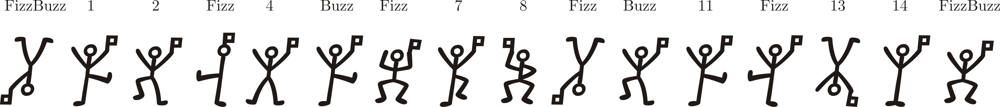

# FizzBuzz
**Fizz buzz** is a group word game for children to teach them about division. Someone chosen by lot starts counting from $1$ then players take turns incerementing a previous number and saying the result except on occasion it should be replaced by
* *Fizz* if the result is divisible by $3$,
* *Buzz* if the result is divisible by $5$,
* *Fizz Buzz* if both occur simultaneously.

A wrong answer means the player is out of the game continued round by round. It would eventually a word chain likes "One, Two, *Fizz*, Four, *Buzz*, *Fizz*, Seven, ..." and a winner who never made a mistake.

**FizzBuzz** is also a common programming task to test basic skills. In this case a sequence from $1$ to $100$ should be a program output and could be obtained in many ways. That is why there are a lot of its implementation in different programming languages. Here we realize a simplified version of FizzBuzz in Qiskit using Grover's Search Algorithm (GSA) for multiple solutions.

Classical approaches are generally based on for loop which body contains a divisibility test. A number of iterations $N$ then equals to length of input and time complexity is a linear function $O\left(N\right)$. Actually it may vary slightly because a database is not complitely unstructured meanwhile quantum computing looks promising to improve significantly.

GSA is an unstructured search algorithm presented by Lov Grover in 1996. Instead of brut force it processes all data in parallel increasing a probability of favorable outcomes in final distribution. To find $k$ solutions in array of $N$ elements $\lfloor\frac\pi4\sqrt\frac N K\rfloor$ iterations are performed thus now time complexity is a square root function $O\left(\sqrt N\right)$. This is quadratic speedup that is why GSA provides quantum supremacy.

The goal is to create a sequence from $0$ to $15$ due to some reasons. All the numbers have a four bit representation, two auxiliary bits are enough to carry a result of check condition that is simplified in the range, and there are two *FizzBuzz* opening and closing the chain.

We break down the task into *Fizz* and *Buzz* parts devising two divisibility tests independent of one another. However their results are very similar. To avoid any confusion we build two quantum circuits differ in the test but have an oracle and a diffuser the same. At the end all measurement results will be processed together to create an output. There are six multiples of $3$ which are $\{ 0, 3, 6, 9, 12, 15\}$ and four multiples of $5$ which are $\{ 0, 5, 10, 15\}$ thus the oracle is applied $\lfloor\frac\pi4\sqrt\frac{16}6\rfloor=1$ time for *Fizz* and $\lfloor\frac\pi4\sqrt\frac{16}4\rfloor=1$ time for *Buzz* circuits. On the whole we call the oracle twice.

The total number of iterations doesn't depend on input length. Each third number is divisible by $3$ so $\frac Nk\approx3$ and each fifth number is divisible by $5$ so $\frac Nk\approx5$. We should make $\lfloor\frac\pi4\sqrt3\rfloor=1$ *Fizz* and $\lfloor\frac\pi4\sqrt5\rfloor=1$ *Buzz* iterations anyway. It means constant time complexity $O\left(2\right)$ conditioned by some input internal structure.
